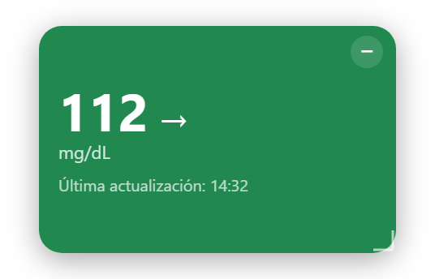
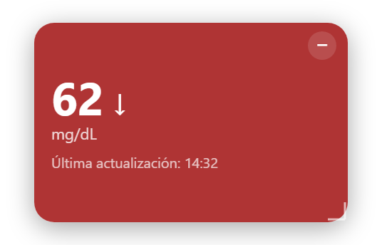

# CGM Float

**A way to see your glucose on your computer.** If you use a Dexcom continuous glucose monitor, your readings usually live on your phone. CGM Float brings them to the Windows desktop: a small always-visible widget (or a number in the system tray, next to the clock) that updates by itself, so you can glance at it while you work or study without picking up your phone.

It connects to your **Dexcom Share** account and shows your glucose in near real time. Built with Tauri 2 (Rust) + React + TypeScript.

> **Important:** this is a personal experiment. It is **not a medical device** and is not affiliated with Dexcom. Do not use it to make treatment decisions (insulin dosing, etc.). Always rely on the official app and device. See [Limitations](#limitations).

## What it looks like

The widget changes color depending on whether you are inside or outside your target range:

| In range | Out of range |
| :---: | :---: |
|  |  |

*Screenshots use example values, not anyone's real readings. The app interface is currently in Spanish (the installed app is called "CGM Flotante").*

## Features

- Borderless, always-on-top floating window that you can drag and resize from the corner.
- Shows the value in mg/dL, the trend arrow and the time of the last reading. The background color changes depending on whether you are inside or outside the target range (70–180 mg/dL by default).
- A "−" button hides it to the system tray. A left click on the tray icon shows or hides the window, and the right-click menu has "Configuración de Dexcom…" (Dexcom settings) and "Salir" (Quit).
- The tray icon itself shows the current number (green in range, red out of range), so you can read it without opening the widget.
- Remembers position and size between restarts (local SQLite).
- Shows simulated data when no account is connected.

## How your credentials are protected

- The Dexcom Share **password** is stored in the Windows Credential Manager, never in the database or in any file.
- It is only sent over HTTPS to Dexcom's servers (`share2.dexcom.com` or `shareous1.dexcom.com`).
- The **username** and region are stored in the local SQLite database (`%APPDATA%\com.cgmflotante.app\cgm_float.db`).

## Build requirements

- Windows 10/11 (with WebView2, which already ships with Windows 11).
- [Node.js](https://nodejs.org/) (LTS).
- [Rust](https://rustup.rs/) (`winget install Rustlang.Rustup`).
- Visual Studio Build Tools with the "Desktop development with C++" workload. On a Windows on ARM machine, also add the "MSVC ARM64 build tools" component.

It was developed and tested on **Windows on ARM64**. It should work the same on x64, but that has not been tested.

## Usage

```bash
npm install
npm run tauri dev      # development mode
npm run tauri build    # builds the installers
```

The installers end up in `src-tauri/target/release/bundle/` (`msi/` and `nsis/`). They are not code-signed, so Windows SmartScreen will show a warning when you install them ("More info" → "Run anyway").

### Connecting your Dexcom account

1. In the Dexcom mobile app, turn on **Dexcom Share**. According to the unofficial clients of the protocol, you usually need at least one follower for readings to be published.
2. In CGM Float: right-click the tray icon → **Configuración de Dexcom…** (Dexcom settings).
3. Enter the username and password of that account and choose the region (United States or outside the United States).
4. Click **Guardar y conectar** (Save and connect). The connection is checked before it is activated.

## Project structure

- `src/`: user interface (React, Zustand). `components/`, `hooks/`, `stores/`, `lib/`.
- `src-tauri/src/`: Rust backend.
  - `dexcom.rs`: Dexcom Share protocol client.
  - `credentials.rs`: password storage in the Windows credential store.
  - `tray.rs`, `tray_icon.rs`, `window.rs`: tray, dynamic icon and windows.
  - `storage/`: SQLite migrations.

## Limitations

- It uses the **unofficial, undocumented** Dexcom Share protocol, discovered by the community. Dexcom can change or block it at any time, and using it may not be allowed by their terms of service: check them before using it.
- Dexcom Share only updates about every 5 minutes. The app polls every 60 s.
- The target range (70–180) is stored in the `user_settings` table, but there is no screen to change it yet.
- There are no alarms or sound alerts.
- The app interface is in Spanish only.

## License

[MIT](LICENSE)
